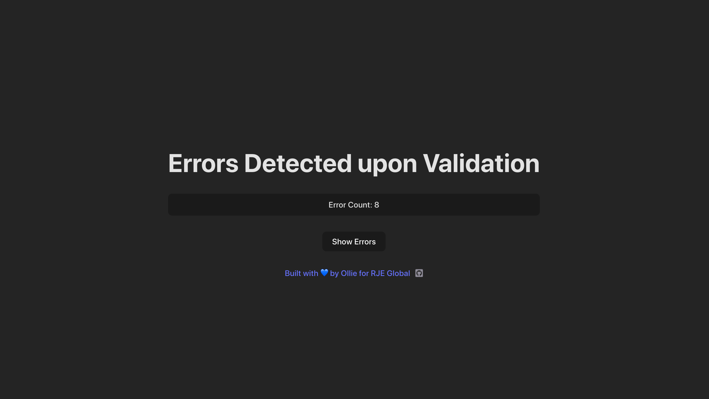
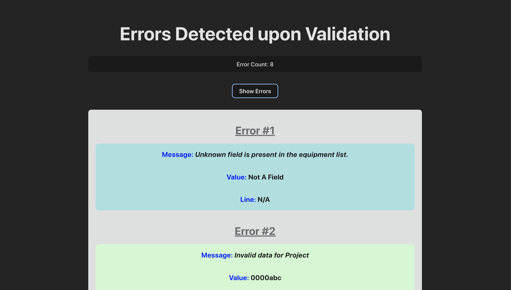

# RJE Global: Coding Task

This is my solution for the coding task for RJE Global's software engineering recruitment program (2023).

I've deployed my solution live here: https://olliequ.github.io/RJE_Task/

## Technical Details

After completing the 4 questions, I decided to do the bonus task by rewriting the repo in ReactJS for the frontend, and Vite.js for the backend. 

The build instructions are:

```
$ npm install
$ npm run dev
```

In the terminal, the will deploy a localhost instance of the application running on a given port, from which you can see and interact with.

Below are some screencaps:




One part of my bonus task solution is a button that displays the detected errors; click the button labeled 'Show Errors' to display them. You can click the button again to hide the errors.

## Questions

Here are my answers to the assigned tasks:

1. ***Extend functionality of the validateColumns() function in validators.js to register a new error if an unknown field is present in the equipment list.***

The crux of my solution is checking if the `field` (column name) is in the `equipmentMap` or not. If it's not, then an error should be thrown!

2. ***Why are all the errors on line 2? Find the bug and fix.***

This was due to scoping issues with the `counter` variable. Moving the initalized variable up a level meant its state was preserved (i.e. `counter++` is remembered.). Changes for this had to be made in both `validateData()` and `validateUniqueKeys()`.

3. ***Update the validation strings on the "Subsystem" and "PLU" fields so that an error is registerd when an '&' symbol is present.***

My solution involved writing a regex pattern to test for the presence of `&`, and assigning it to the "Subsystem" and "PLU" fields. Specifically, my solution is: `/^[^&]+$/`.

4. - ***Add some HTML and CSS to the response object so that the errors list is more human readable***
   - ***Rewrite this program using a front end technology.***

I completed the bonus task! To make the codebase React compatible, I did a *lot* of refactoring. But, it was worth in the end because now I have a beautiful interface!